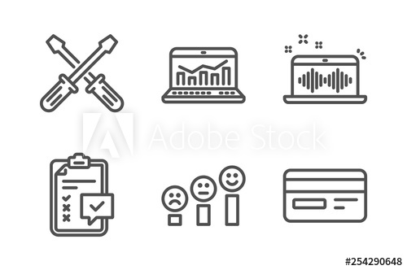

# Data-Lake-on-S3 using Spark EMR Cluster
(Udacity: Data Engineering Nano Degree) | learngvrk@gmail.com | 2020-05-23 This project is a part of Udacity's Data Engineer Nano Degree.

## Project 3 - Data-Lake-on-S3 using Spark EMR Cluster

Courtesy: Adobe Stock Images

### Background:
The startup Sparkify was interested to analyze the data collected from the user activity on their music app on the mobile phones.

Based on the user activity the startup would like to perform some analytics to derive insights which will help the organization to better understand the user behavior, and so add more interesting features to their mobile app which would enhance the user experience and stratergize the product development roadmap.

### Problem Statement:
Sparkify, has grown its user base, song database and are finding it very expensive to maintain a 24x7 EMR (EC2 based) cluster with HDFS to move their data existing warehouse to a data lake and is looking to cut costs.

### Proposed Solution:
The proposed solution is to build a ETL pipeline that extracts their data from S3, processes them using Spark, and loads the data back into S3 (Data Lake) as a set of dimensional tables. This will allow their analytics team to continue finding insights in what songs their users are listening to.

### High Level Design
	1. Read song and user log data (files) from the existing staging area (Amazon S3)
	2. Process the data using Spark (local or EMR cluster)
	3. Convert the data into dimension tables (Star schema)
	4. Store the data back to a Data lake (Amazon S3)
  

### Database Schema

- The modeling team has come up with the following **STAR-SCHEMA** which captures all the important dimensions needed to create the fact table.
- Artists, Users, Songs, Time are the most quintessential dimensions needed to build the fact table, which is then used to derive insights.
- **FACT TABLE:** contains the required dimensions to categorize and their measures (build aggregations) to derive facts, which enables analyze the user behavior.

### Perform Normalization
> 1. Ensured the Dimension tables meet the 3NF (Normalization Form)
> 2. Most Important features of the selected Dimension data are used as table columns.
> 3. One-to-Many relationship with the Fact (OLAP) Table.

### Create Dimension Tables
Created the following **DIMENSION** tables
> 1. Users: user info (columns: user_id, first_name, last_name, gender, level)
> 2. Songs: song info (columns: song_id, title, artist_id, year, duration [Partition Key: year, artist_id])
> 3. Artists: artist info (columns: artist_id, name, location, latitude, longitude)
> 4. Time: detailed time info about song plays (columns: start_time, hour, day, week, month, year, weekday [Partition Key: year, month])

### Perform Denormalization
> 1. Ensured the Fact tables have all the primary keys of the Dimension tables.
> 2. All the categories of the Dimension tables are included within the Fact tables.
> 3. All the required measures can be calculated using the aggregation function performed on the categories (data).

### Create the FACT table: 
> songplays: song play data together with user, artist, and song info (songplay_id, start_time, year, month, user_id, level, song_id, artist_id, session_id, location, user_agent [Partition Key: year, month])

### Environment Setup
1. Created a Jupyter Notebook to check if the basic connections of the pipeline can be created.
2. Created a configuration file to capture the following credentials.
   a. User access key id, secret key (AWS)
   b. Raw data files in S3 bucket (Location)
   c. Output data files in S3 (Location)
3. Created a Spark session (Local cluster)
4. Read the configuration details from the Config file.
5. Read the Input data (song data, user log data) as JSON files from S3 bucket into a Spark DataFrame.
6. View the data exists in the DataFrame.
7. Transform the Input data into Dimension tables (songs, artists, users and time) with partition keys to 
8. Convert the DataFrame(s) into Parquet files (columnar format) 
9. Create the Fact Table DataFrame based on the 3NF and required partition keys (for faster and efficient data reads).
10. 

### SQL Queries
<ol>
  <li> Establish connection to the local instance of the Postgres DB.</li>
  <li> Create CREATE TABLE statements to Create Dimension and Fact tables.</li>
  <li> Create INSERT INTO TABLE statements to enter the songs and log data into the Dimension and Fact table.</li>
</ol>

### Perform ETL
<ol>
<li> Extract data from songs data JSON file to fill in the **SONGS** and **ARTISTS** dimension table.</li>
<li> Extract data from log data JSON file to fill in the **USERS** and **TIME** dimension table.</li>
<ol>
  <li> Timestamp is represented as milliseconds in the log data.</li>
  <li> Timestamp is transformed into **Time (hh:mm:ss), Hour, Day, Week of Year, Month, Year, Day of Week**.</li>
</ol>
<li> Extract the log data, and data from dimension tables to fill in the **SONGPLAYS** FACT table.</li>
</ol>

### Convert Jupter Note Book Code into Modular Python code (.py) file
1. Convert the Python Scripts from the web kernel to modular Python code (.py) file.
2. Create common functions to perform the database and ETL functions.

### Sample Queries which can be used for Analytics
- For a given user what is his favorite songs (most played ones)
- What is the most played songs (Toppers) at a given time of the day or season based on user demographics
- Is there a song which is played across all regions of the country.
