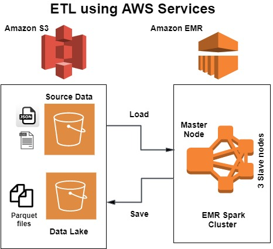
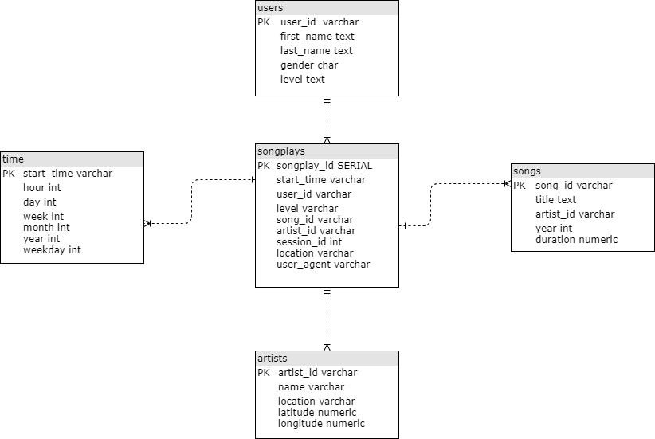

# 100DaysOfCode
100 Days of Coding Challenge

### Daily Log: https://github.com/ranjithpals/100DaysOfCode/blob/master/dailyLog

[05.11.2020] I have decided to start with #100DaysOfCode
challenge which I believe would be my first step as I embark on my journey into Data Engineering and Data Science. I am taking this challenge for the following important reasons.

- Habit - By committing to this challenge I want to make coding a habit which will bring about a change to my life as any habit would do.
- Accountability - Make myself accountable to post updates on a daily basis and ensure I do not break the habit.
- Inspiration - There have been few friends and mentors in Linkedin who have inspired me to take this challenge and possibly by the end of this challenge I wish I inspire few others.
- Projects - Would love to Identify problems which would need Data Engineering & Data Science to provide a solution, and work on solving them.

https://www.100daysofcode.com/
